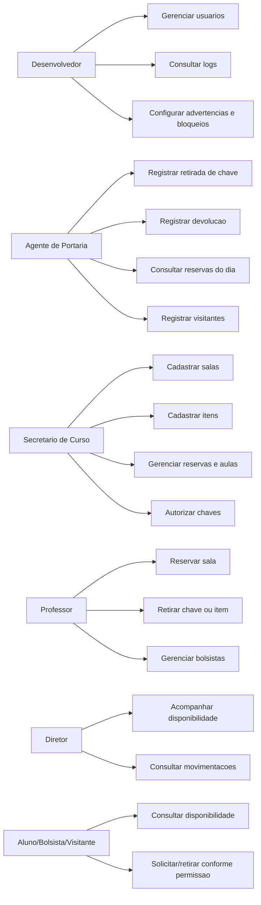
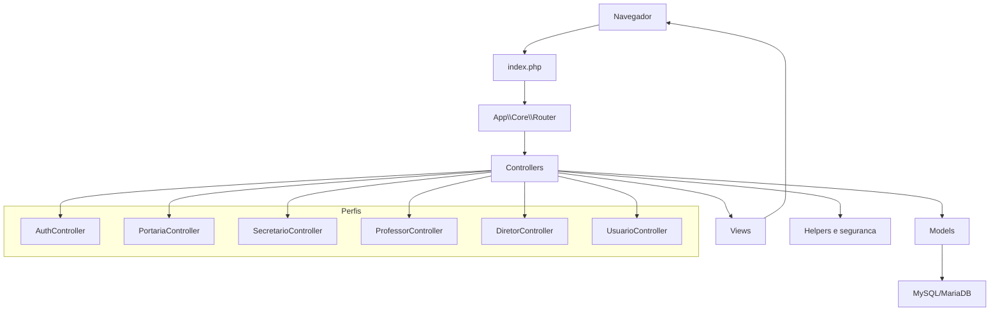
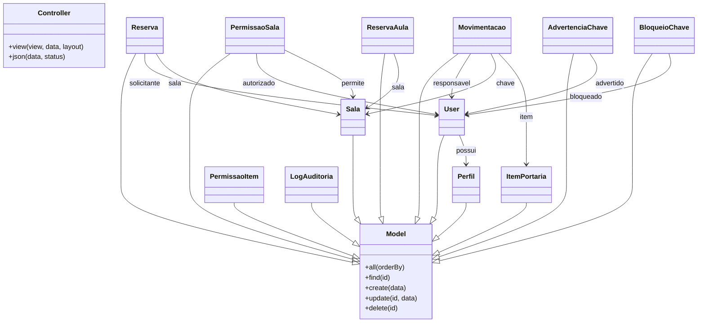
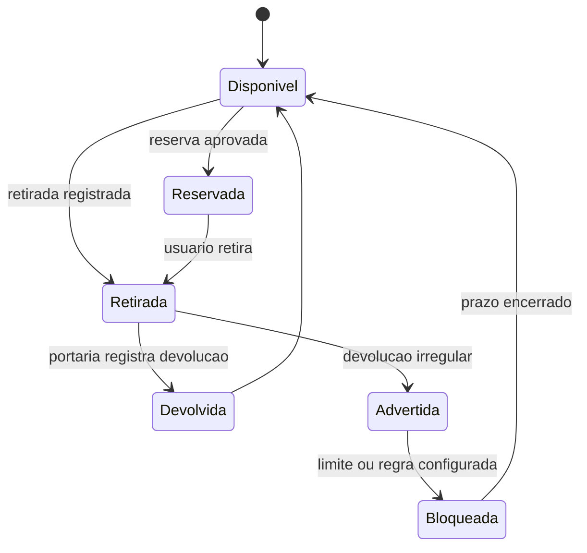

# UML - Sistema de Portaria CTIC

## Casos de uso

```mermaid
flowchart LR
    Dev["Desenvolvedor"]
    Portaria["Agente de Portaria"]
    Secretaria["Secretario de Curso"]
    Professor["Professor"]
    Diretor["Diretor"]
    Usuario["Aluno/Bolsista/Visitante"]

    Dev --> UC1["Gerenciar usuarios"]
    Dev --> UC2["Consultar logs"]
    Dev --> UC3["Configurar advertencias e bloqueios"]

    Portaria --> UC4["Registrar retirada de chave"]
    Portaria --> UC5["Registrar devolucao"]
    Portaria --> UC6["Consultar reservas do dia"]
    Portaria --> UC7["Registrar visitantes"]

    Secretaria --> UC8["Cadastrar salas"]
    Secretaria --> UC9["Cadastrar itens"]
    Secretaria --> UC10["Gerenciar reservas e aulas"]
    Secretaria --> UC11["Autorizar chaves"]

    Professor --> UC12["Reservar sala"]
    Professor --> UC13["Retirar chave ou item"]
    Professor --> UC14["Gerenciar bolsistas"]

    Diretor --> UC15["Acompanhar disponibilidade"]
    Diretor --> UC16["Consultar movimentacoes"]

    Usuario --> UC17["Consultar disponibilidade"]
    Usuario --> UC18["Solicitar/retirar conforme permissao"]
```

## Arquitetura MVC

```mermaid
flowchart TB
    Browser["Navegador"]
    Entry["index.php"]
    Router["App\\Core\\Router"]
    Controllers["Controllers"]
    Models["Models"]
    Views["Views"]
    Database["MySQL/MariaDB"]
    Helpers["Helpers e seguranca"]

    Browser --> Entry
    Entry --> Router
    Router --> Controllers
    Controllers --> Models
    Controllers --> Views
    Controllers --> Helpers
    Models --> Database
    Views --> Browser

    subgraph Perfis
        Auth["AuthController"]
        PortariaC["PortariaController"]
        SecretarioC["SecretarioController"]
        ProfessorC["ProfessorController"]
        DiretorC["DiretorController"]
        UsuarioC["UsuarioController"]
    end

    Controllers --> Auth
    Controllers --> PortariaC
    Controllers --> SecretarioC
    Controllers --> ProfessorC
    Controllers --> DiretorC
    Controllers --> UsuarioC
```

## Classes principais

```mermaid
classDiagram
    class Controller {
        +view(view, data, layout)
        +json(data, status)
    }

    class Model {
        +all(orderBy)
        +find(id)
        +create(data)
        +update(id, data)
        +delete(id)
    }

    class User
    class Perfil
    class Sala
    class Reserva
    class ReservaAula
    class ItemPortaria
    class PermissaoSala
    class PermissaoItem
    class Movimentacao
    class AdvertenciaChave
    class BloqueioChave
    class LogAuditoria

    User --|> Model
    Perfil --|> Model
    Sala --|> Model
    Reserva --|> Model
    ReservaAula --|> Model
    ItemPortaria --|> Model
    PermissaoSala --|> Model
    PermissaoItem --|> Model
    Movimentacao --|> Model
    AdvertenciaChave --|> Model
    BloqueioChave --|> Model
    LogAuditoria --|> Model

    User --> Perfil : possui
    Reserva --> User : solicitante
    Reserva --> Sala : sala
    ReservaAula --> Sala : sala
    PermissaoSala --> User : autorizado
    PermissaoSala --> Sala : permite
    Movimentacao --> User : responsavel
    Movimentacao --> Sala : chave
    Movimentacao --> ItemPortaria : item
    AdvertenciaChave --> User : advertido
    BloqueioChave --> User : bloqueado
```

## Fluxo de chave

```mermaid
stateDiagram-v2
    [*] --> Disponivel
    Disponivel --> Reservada: reserva aprovada
    Disponivel --> Retirada: retirada registrada
    Reservada --> Retirada: usuario retira
    Retirada --> Devolvida: portaria registra devolucao
    Retirada --> Advertida: devolucao irregular
    Advertida --> Bloqueada: limite ou regra configurada
    Devolvida --> Disponivel
    Bloqueada --> Disponivel: prazo encerrado
```
