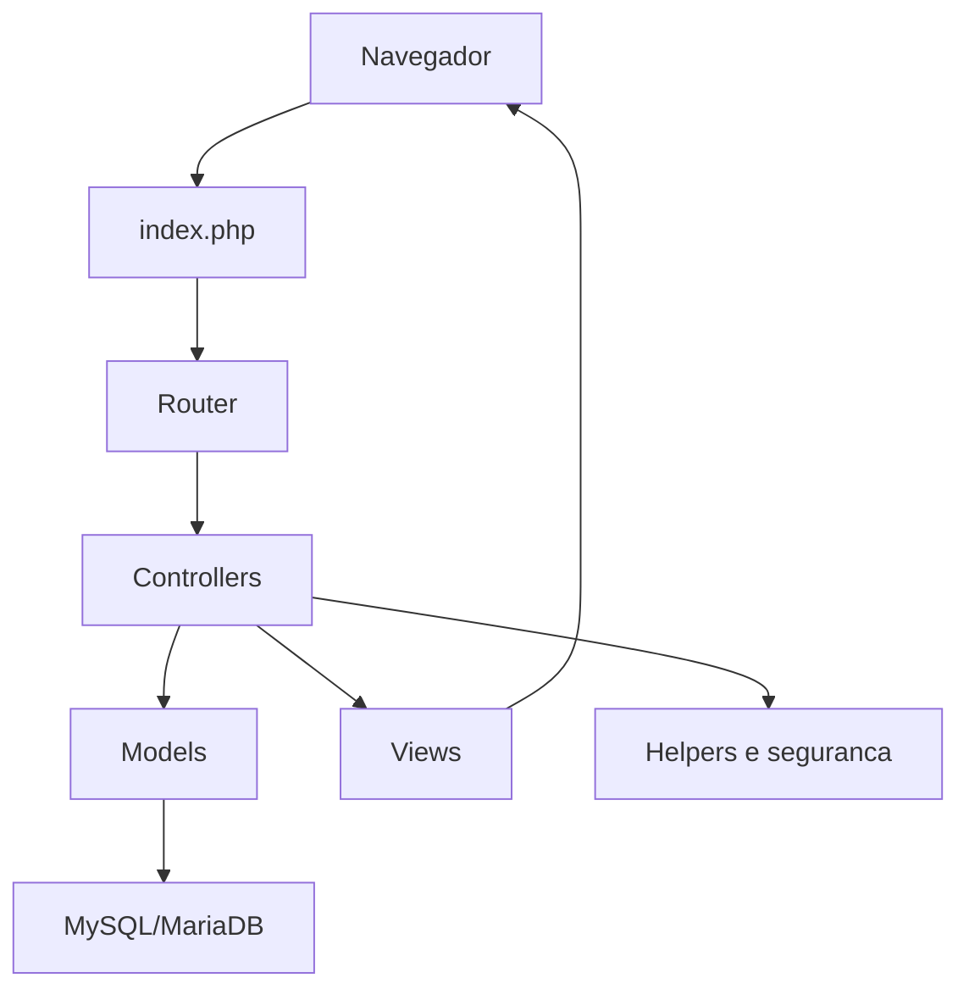

# Arquitetura MVC

```mermaid
flowchart TB
    Browser["Navegador"]
    Entry["index.php"]
    Router["Router"]
    Controllers["Controllers"]
    Models["Models"]
    Views["Views"]
    Database["MySQL/MariaDB"]
    Helpers["Helpers e seguranca"]

    Browser --> Entry
    Entry --> Router
    Router --> Controllers
    Controllers --> Models
    Controllers --> Views
    Controllers --> Helpers
    Models --> Database
    Views --> Browser
```
