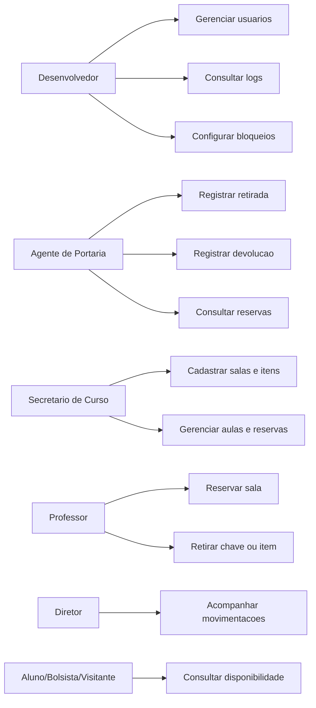

# Casos de uso

```mermaid
flowchart LR
    Dev["Desenvolvedor"]
    Portaria["Agente de Portaria"]
    Secretaria["Secretario de Curso"]
    Professor["Professor"]
    Diretor["Diretor"]
    Usuario["Aluno/Bolsista/Visitante"]

    Dev --> UC1["Gerenciar usuarios"]
    Dev --> UC2["Consultar logs"]
    Dev --> UC3["Configurar bloqueios"]
    Portaria --> UC4["Registrar retirada"]
    Portaria --> UC5["Registrar devolucao"]
    Portaria --> UC6["Consultar reservas"]
    Secretaria --> UC7["Cadastrar salas e itens"]
    Secretaria --> UC8["Gerenciar aulas e reservas"]
    Professor --> UC9["Reservar sala"]
    Professor --> UC10["Retirar chave ou item"]
    Diretor --> UC11["Acompanhar movimentacoes"]
    Usuario --> UC12["Consultar disponibilidade"]
```
