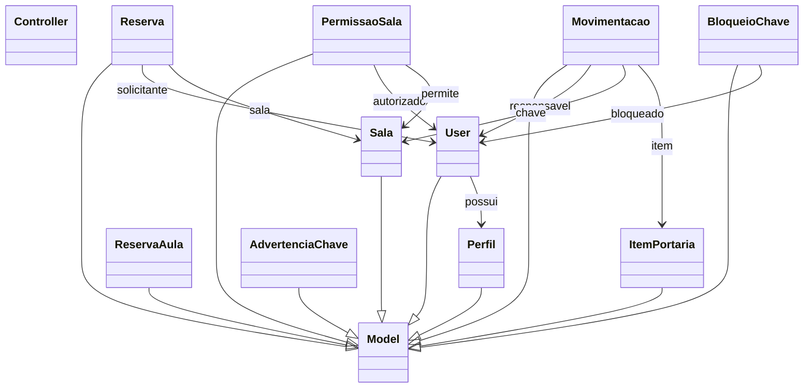

# Classes principais

```mermaid
classDiagram
    class Controller
    class Model
    class User
    class Perfil
    class Sala
    class Reserva
    class ReservaAula
    class ItemPortaria
    class PermissaoSala
    class Movimentacao
    class AdvertenciaChave
    class BloqueioChave

    User --|> Model
    Perfil --|> Model
    Sala --|> Model
    Reserva --|> Model
    ReservaAula --|> Model
    ItemPortaria --|> Model
    PermissaoSala --|> Model
    Movimentacao --|> Model
    AdvertenciaChave --|> Model
    BloqueioChave --|> Model

    User --> Perfil : possui
    Reserva --> User : solicitante
    Reserva --> Sala : sala
    PermissaoSala --> User : autorizado
    PermissaoSala --> Sala : permite
    Movimentacao --> User : responsavel
    Movimentacao --> Sala : chave
    Movimentacao --> ItemPortaria : item
    BloqueioChave --> User : bloqueado
```
