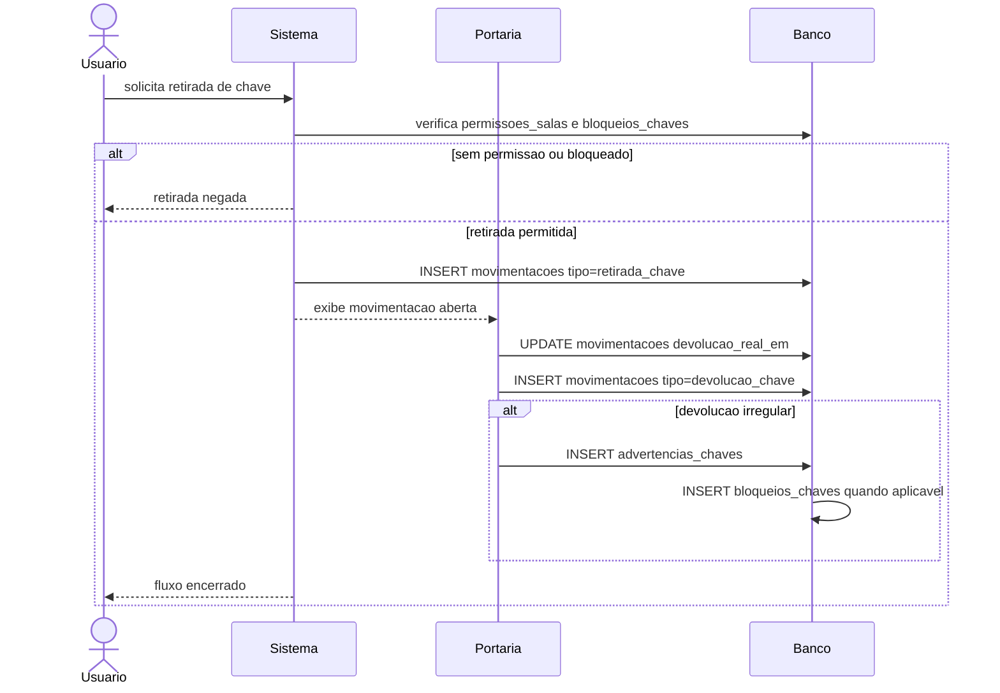

# Fluxo de retirada e devolucao de chave

```mermaid
sequenceDiagram
    actor Usuario
    participant Sistema
    participant Portaria
    participant Banco

    Usuario->>Sistema: solicita retirada de chave
    Sistema->>Banco: verifica permissoes_salas e bloqueios_chaves
    alt sem permissao ou bloqueado
        Sistema-->>Usuario: retirada negada
    else retirada permitida
        Sistema->>Banco: INSERT movimentacoes tipo=retirada_chave
        Sistema-->>Portaria: exibe movimentacao aberta
        Portaria->>Banco: UPDATE movimentacoes devolucao_real_em
        Portaria->>Banco: INSERT movimentacoes tipo=devolucao_chave
        alt devolucao irregular
            Portaria->>Banco: INSERT advertencias_chaves
            Banco->>Banco: INSERT bloqueios_chaves quando aplicavel
        end
        Sistema-->>Usuario: fluxo encerrado
    end
```
