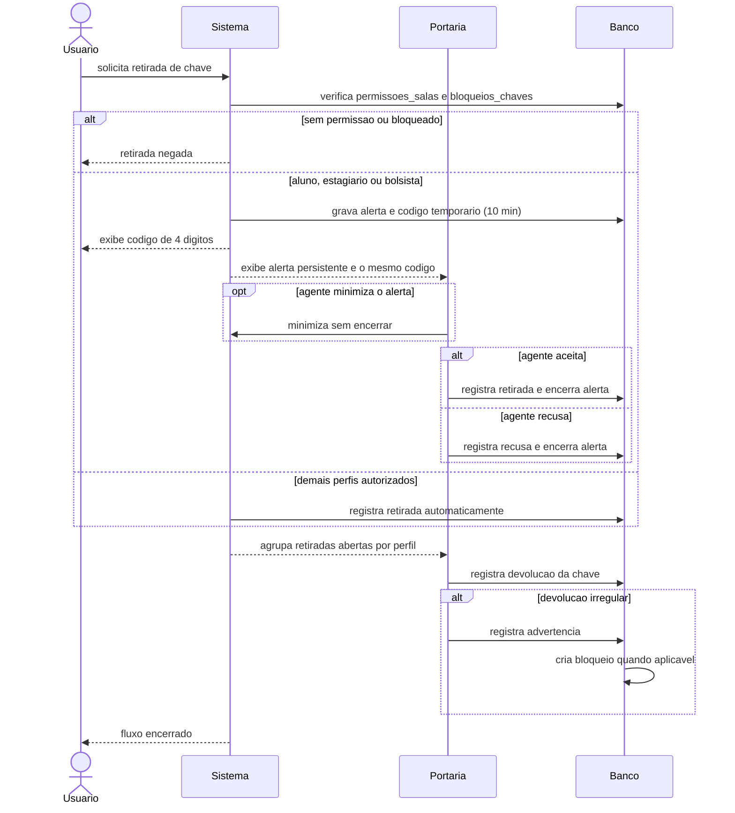

# Fluxo de retirada e devolucao de chave

Alunos, estagiarios e bolsistas iniciam a solicitacao no proprio acesso. A Portaria
recebe um alerta persistente, que pode ser minimizado, e aceita ou recusa a entrega.
Para esses perfis, o codigo simples de quatro digitos fica visivel tanto para o
solicitante quanto para o agente. Os demais perfis autorizados usam retirada
automatica. Servicos Gerais mantem o fluxo proprio de trabalho.

A Portaria nao cadastra nem edita manualmente permissoes de Aluno, Aluno Bolsista
ou Estagiario. Esses perfis nao aparecem nos seletores do agente e seguem o fluxo
proprio de solicitacao/autorizacao; permissoes antigas ficam disponiveis apenas
para consulta ou revogacao.

