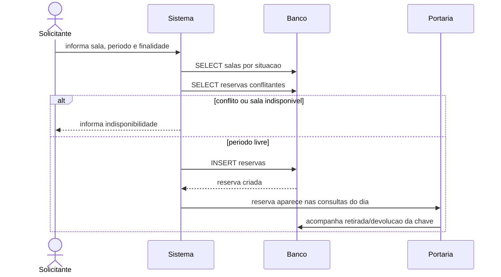

# Fluxo de reserva de sala

```mermaid
sequenceDiagram
    actor Solicitante
    participant Sistema
    participant Banco
    participant Portaria

    Solicitante->>Sistema: informa sala, periodo e finalidade
    Sistema->>Banco: SELECT salas por situacao
    Sistema->>Banco: SELECT reservas conflitantes
    alt conflito ou sala indisponivel
        Sistema-->>Solicitante: informa indisponibilidade
    else periodo livre
        Sistema->>Banco: INSERT reservas
        Banco-->>Sistema: reserva criada
        Sistema->>Portaria: reserva aparece nas consultas do dia
        Portaria->>Banco: acompanha retirada/devolucao da chave
    end
```
