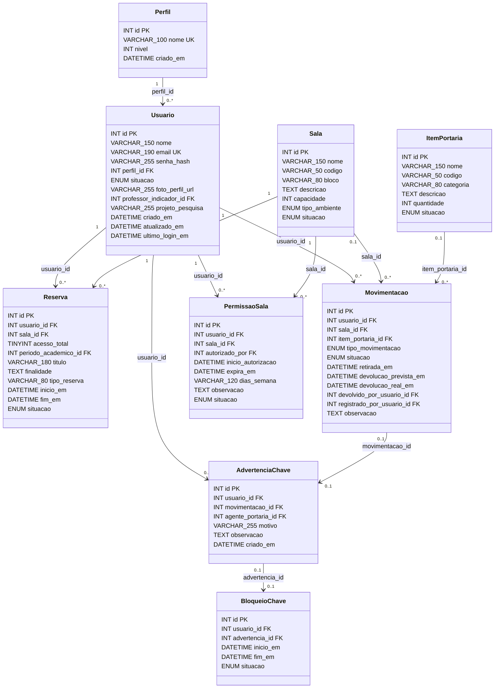

# Modelo de dados

```mermaid
classDiagram
    class Perfil {
        INT id PK
        VARCHAR_100 nome UK
        INT nivel
        DATETIME criado_em
    }

    class Usuario {
        INT id PK
        VARCHAR_150 nome
        VARCHAR_190 email UK
        VARCHAR_255 senha_hash
        INT perfil_id FK
        ENUM situacao
        VARCHAR_255 foto_perfil_url
        INT professor_indicador_id FK
        VARCHAR_255 projeto_pesquisa
        DATETIME criado_em
        DATETIME atualizado_em
        DATETIME ultimo_login_em
    }

    class Sala {
        INT id PK
        VARCHAR_150 nome
        VARCHAR_50 codigo
        VARCHAR_80 bloco
        TEXT descricao
        INT capacidade
        ENUM tipo_ambiente
        ENUM situacao
    }

    class Reserva {
        INT id PK
        INT usuario_id FK
        INT sala_id FK
        TINYINT acesso_total
        INT periodo_academico_id FK
        VARCHAR_180 titulo
        TEXT finalidade
        VARCHAR_80 tipo_reserva
        DATETIME inicio_em
        DATETIME fim_em
        ENUM situacao
    }

    class ItemPortaria {
        INT id PK
        VARCHAR_150 nome
        VARCHAR_50 codigo
        VARCHAR_80 categoria
        TEXT descricao
        INT quantidade
        ENUM situacao
    }

    class Movimentacao {
        INT id PK
        INT usuario_id FK
        INT sala_id FK
        INT item_portaria_id FK
        ENUM tipo_movimentacao
        ENUM situacao
        DATETIME retirada_em
        DATETIME devolucao_prevista_em
        DATETIME devolucao_real_em
        INT devolvido_por_usuario_id FK
        INT registrado_por_usuario_id FK
        TEXT observacao
    }

    class PermissaoSala {
        INT id PK
        INT usuario_id FK
        INT sala_id FK
        INT autorizado_por FK
        DATETIME inicio_autorizacao
        DATETIME expira_em
        VARCHAR_120 dias_semana
        TEXT observacao
        ENUM situacao
    }

    class AdvertenciaChave {
        INT id PK
        INT usuario_id FK
        INT movimentacao_id FK
        INT agente_portaria_id FK
        VARCHAR_255 motivo
        TEXT observacao
        DATETIME criado_em
    }

    class BloqueioChave {
        INT id PK
        INT usuario_id FK
        INT advertencia_id FK
        DATETIME inicio_em
        DATETIME fim_em
        ENUM situacao
    }

    Perfil "1" --> "0..*" Usuario : perfil_id
    Usuario "1" --> "0..*" Reserva : usuario_id
    Sala "1" --> "0..*" Reserva : sala_id
    Usuario "1" --> "0..*" Movimentacao : usuario_id
    Sala "0..1" --> "0..*" Movimentacao : sala_id
    ItemPortaria "0..1" --> "0..*" Movimentacao : item_portaria_id
    Usuario "1" --> "0..*" PermissaoSala : usuario_id
    Sala "1" --> "0..*" PermissaoSala : sala_id
    Usuario "1" --> "0..*" AdvertenciaChave : usuario_id
    Movimentacao "0..1" --> "0..1" AdvertenciaChave : movimentacao_id
    AdvertenciaChave "0..1" --> "0..1" BloqueioChave : advertencia_id
```
